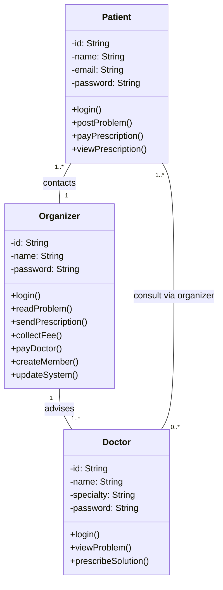
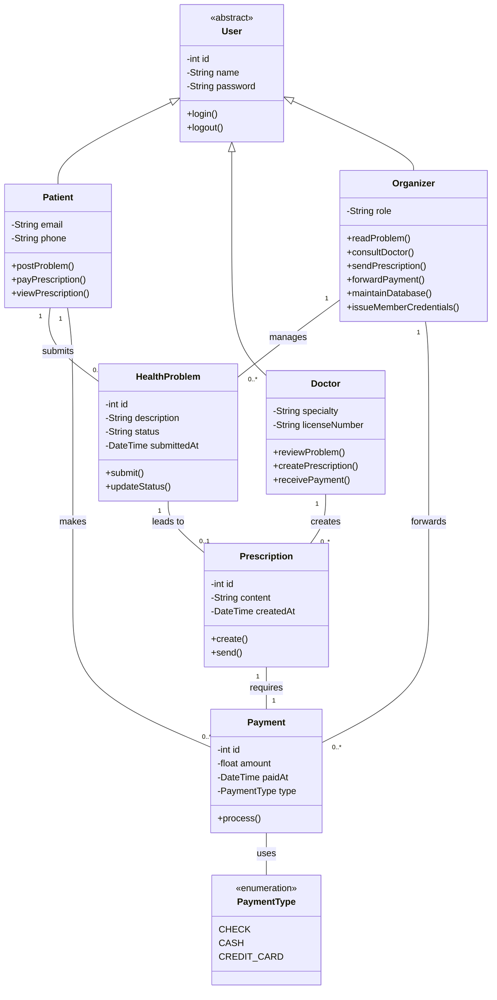
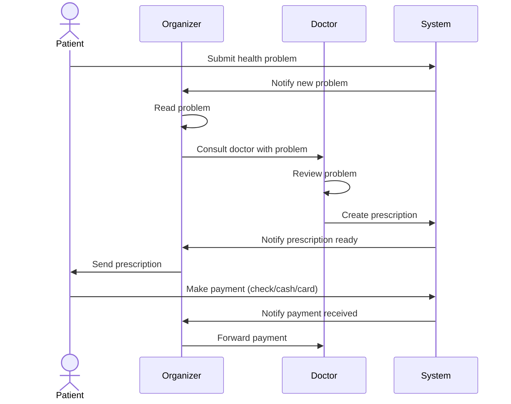
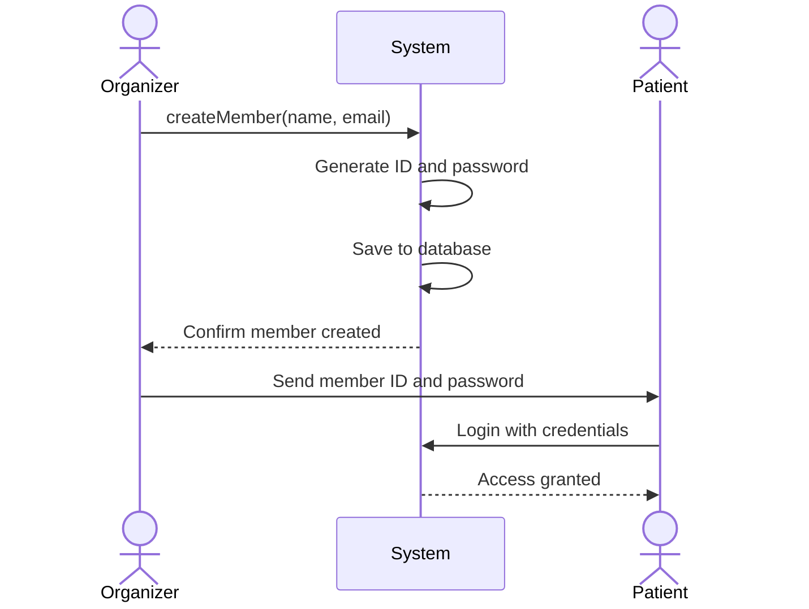
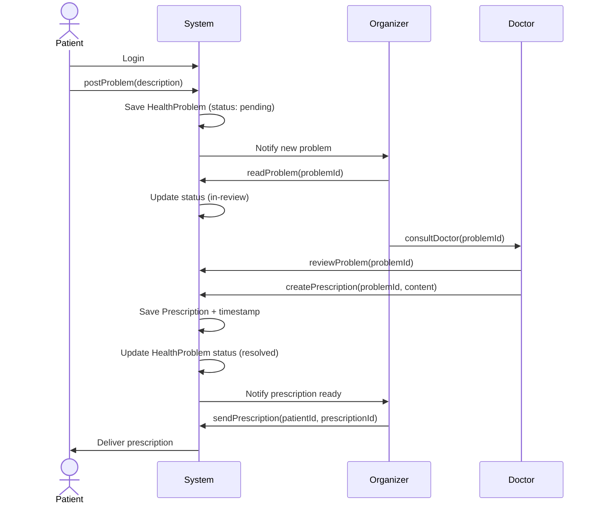
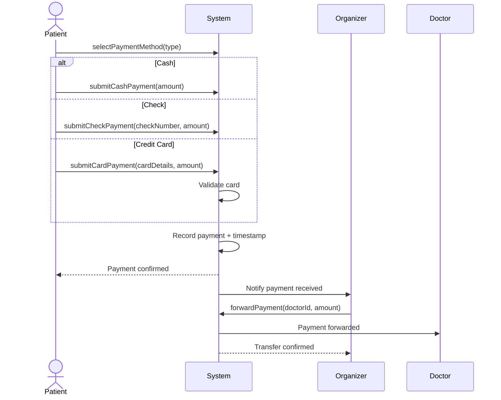

# Exo 1 - Hospital Management System 🏥

## Task 1: Basic Class Diagram (3 classes)

---

## Task 2: Complete Class Diagram (6 classes) + Sequence Diagram

### Class Diagram

### Sequence Diagram: Patient submits problem, receives prescription, and pays

---

## Task 3: Advanced - System Sequence Diagrams

### 1. Patient Registration

### 2. Consultation Flow

### 3. Payment Processing

---

## Questions to Consider

**1. How would you handle a patient consulting multiple doctors?**
The class diagram already supports this through the Organizer, who can consult multiple doctors for a single HealthProblem. You could add a many-to-many relationship between HealthProblem and Doctor if needed.

**2. Should prescriptions be reusable? How would you model that?**
Prescriptions should not be reusable as-is, since each one is tied to a specific health problem. However, a doctor could reference past prescriptions when creating a new one. This could be modeled with a self-referencing association on the Prescription class (e.g., `referencePrescription`).

**3. What design pattern fits the payment system?**
The Strategy pattern. Each payment type (Cash, Check, CreditCard) implements a common Payment interface with a `process()` method. This allows the system to handle different payment methods without changing the core logic.

**4. How do you ensure data integrity when payments are processed?**
Use transactions at the database level to ensure that payment recording and forwarding happen atomically. If any step fails, the entire operation is rolled back. Also add validation checks on amounts and status updates.

