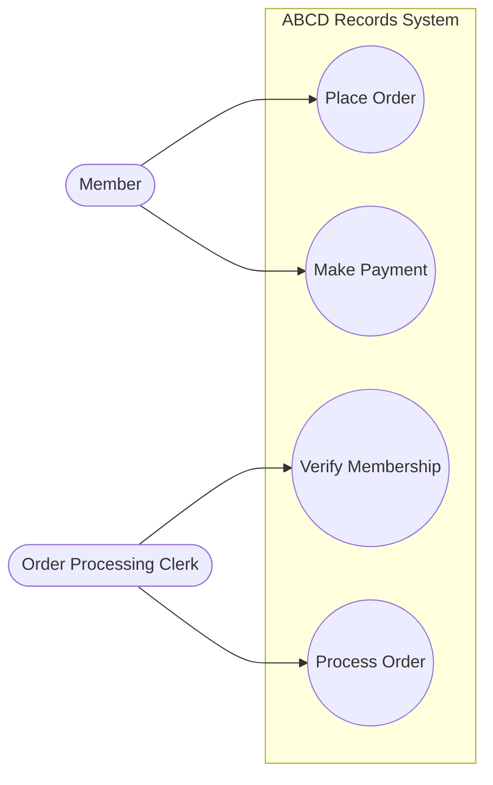
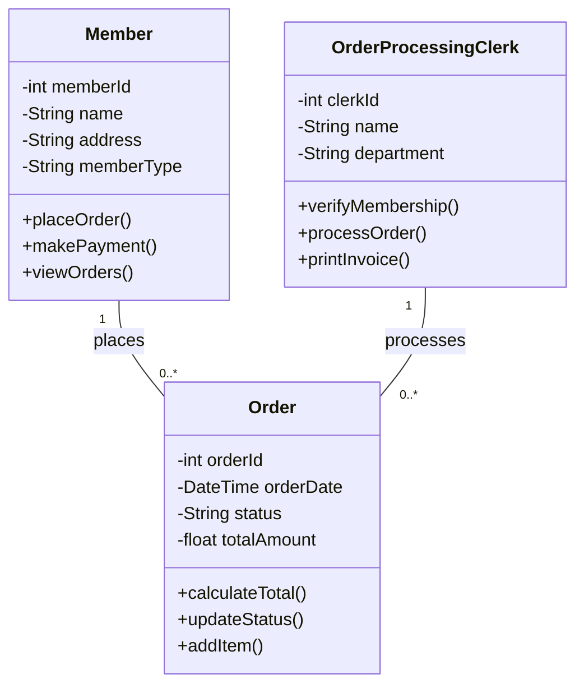
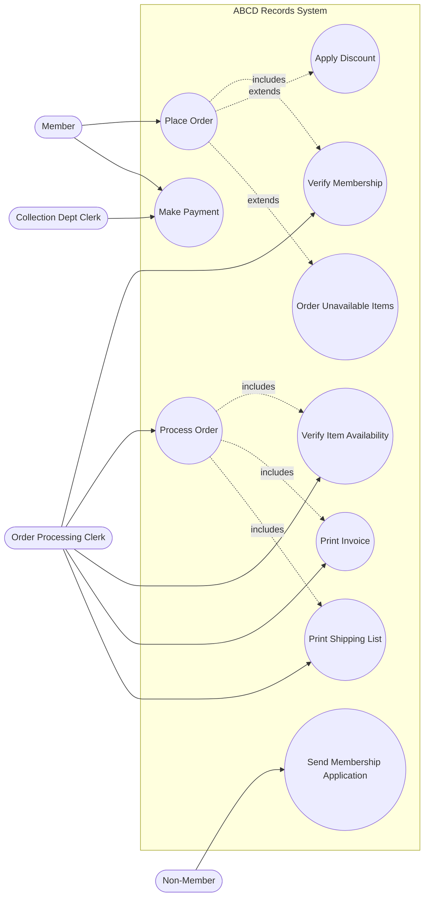
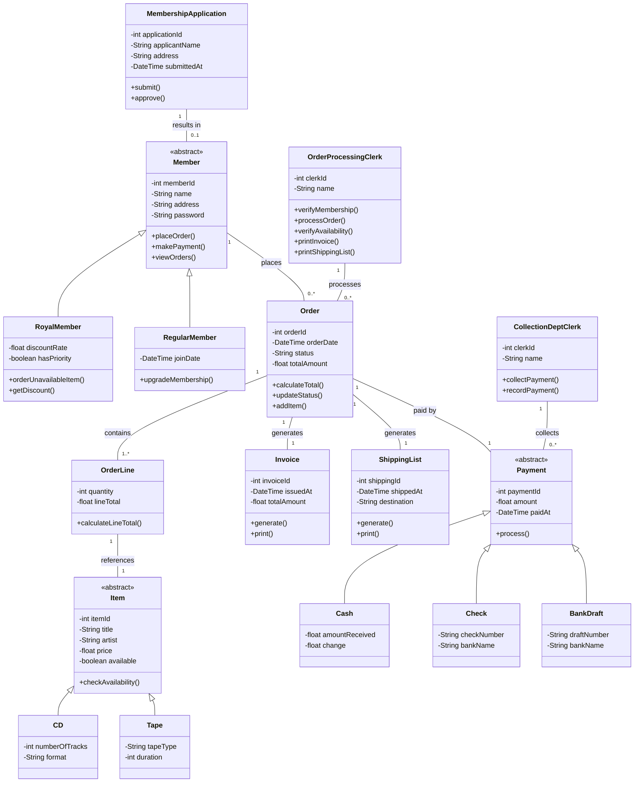
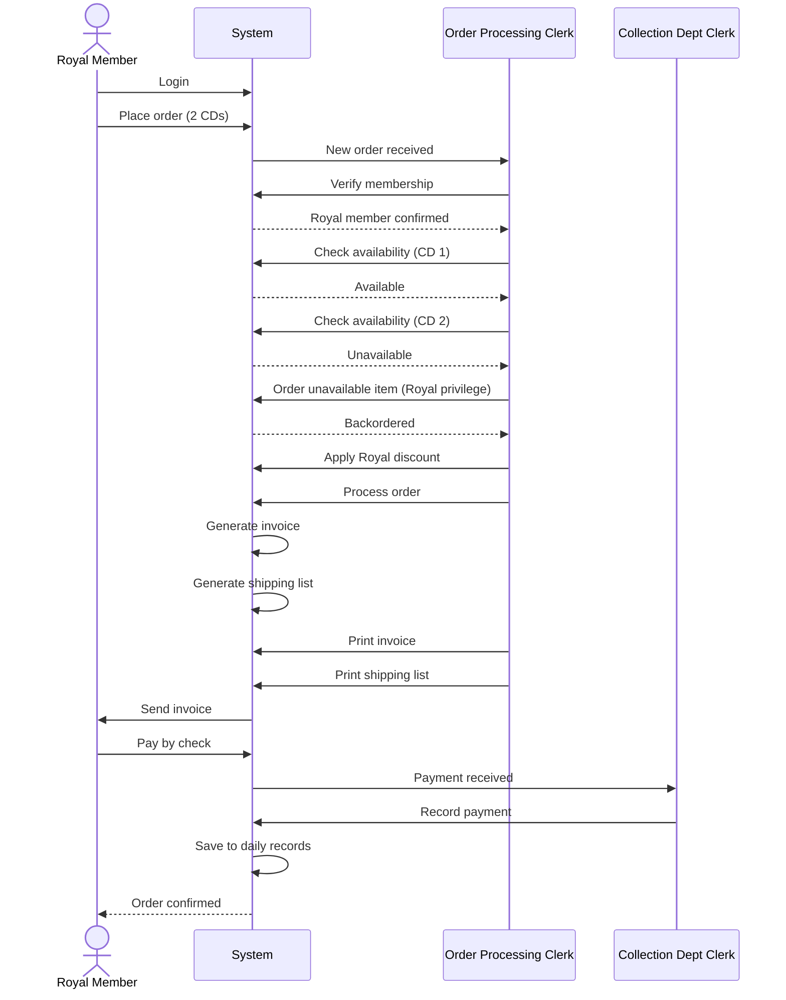
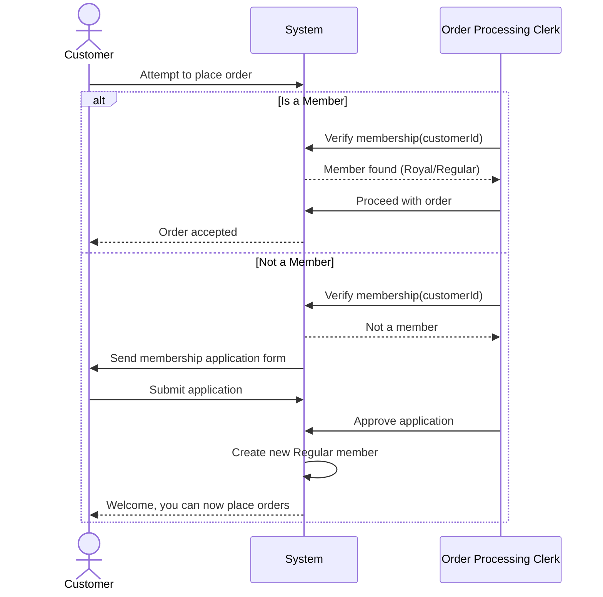
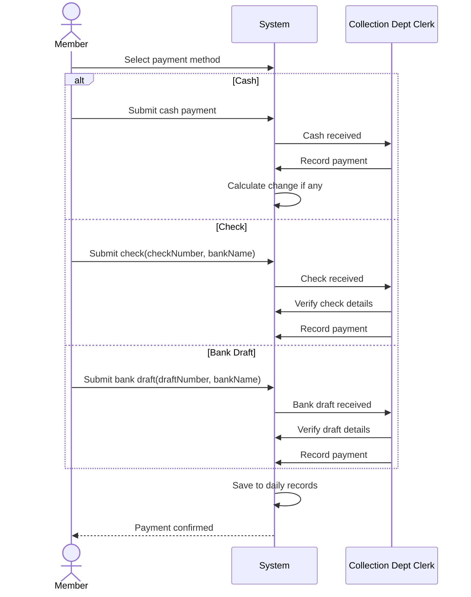
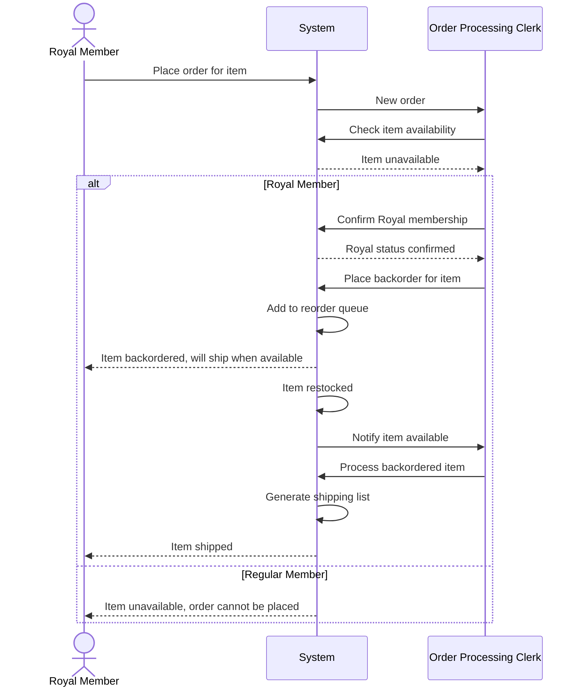

# Exo 2 - ABCD Records 📼

## Level 1

### Task 1.1: Basic Use Case Diagram

### Task 1.2: Basic Class Diagram

---

## Level 2

### Task 2.1: Complete Use Case Diagram

### Task 2.2: Complete Class Diagram

---

## Level 3: Advanced Sequence Diagrams

### 1. Complete Order Processing Flow

### 2. Membership Verification (Success and Failure)

### 3. Payment Processing (All Types)

### 4. Item Reordering for Royal Members

